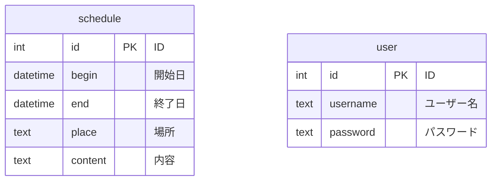

https://github.com/ManayaT/schedule_management

## 使用技術
      

# スケジュール管理用Webアプリ

## プロジェクトの概要
- プロジェクトの目的 <br>
  登録ユーザでログイン後，スケジュールの表示，登録，変更，削除機能の実装

## システム概要
　このシステムでは，以下の機能を実装している<br>
　　i.　登録ユーザでのログイン<br>
　　ii.　スケジュールの表示<br>
　　iii.　スケジュールの登録<br>
　　iV.　会員画面の表示<br>
　　V.　レシピの投稿<br>
　　Vi.　レシピの削除<br>
　　Vii.　レシピの検索<br>
　　Viii.　レシピのお気に入り登録<br>

## 環境
| 言語・フレームワーク　　　　　 　 | バージョン 　|
| ------------------ | -------- |
| HTML               | HTML5    |
| PHP                | 7.4.33   |
| MySQL              | 7.4.33   |
| MAMP               | 7.0      |
| Smarty             | 3.1.30   |


## ディレクトリ構成
```
htdocs
.
├── adjust_schedule.php
├── delete_schedule.php
├── index.php
├── js
├── login.php
├── schedule_list.php
├── set_schedule.php
├── smarty
│   └── smarty系
├── spl
│   ├── schedule.sql
│   └── user.sql
├── temp
│   ├── bbs_mysql.php
│   ├── config.php
│   ├── link.php
│   └── linkadmin.php
├── templates
│   ├── adjustSchedule.html
│   ├── deleteSchedule.html
│   ├── login.html
│   ├── scheduleList.html
│   └── setSchedule.html
└── templates_c
    └── Smarty用フォルダ
※一部省略
```

## 環境構築
- MAMPのインストール<br>
  MAMPの最新版をインストールしたのち，以下のコマンド
  ```
  $ cd /Applications/MAMP/fcgi-bin
  $ sed 's/8\.3\.1/8\.2\.20/g' php8.3.1.fcgi > php8.2.20.fcgi
  $ sed 's/8\.3\.1/8\.3\.9/g' php8.3.1.fcgi > php8.3.9.fcgi
  ```
  を実行する．

  続いて，Apache PortとNginx Portをそれぞれ80に設定する．

## 実行方法
- MAMPの起動<br>
  i, MAMPを起動し全てのサーバーを実行可能状態とする<br>
  ii, h_ttp://localhost/index.phpにアクセスする

## データベースのテーブル一覧



